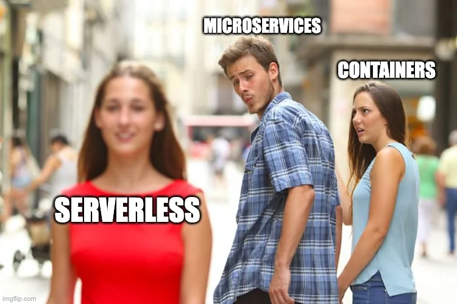
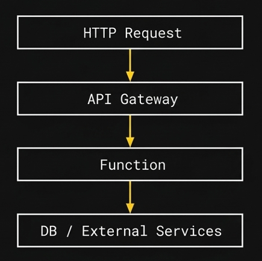
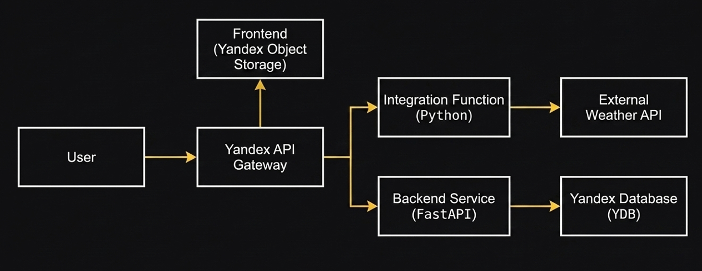

# Введение в serverless: как собрать сервис без серверов

- [Введение в serverless: как собрать сервис без серверов](#введение-в-serverless-как-собрать-сервис-без-серверов)
- [О чём будет речь](#о-чём-будет-речь)
- [Что такое serverless](#что-такое-serverless)
- [Как это выглядит архитектурно](#как-это-выглядит-архитектурно)
      - [Как это работает внутри](#как-это-работает-внутри)
      - [Где хранится состояние](#где-хранится-состояние)
- [Ключевые ограничения](#ключевые-ограничения)
- [Набор сервисов serverless стека в Яндекс облаке](#набор-сервисов-serverless-стека-в-яндекс-облаке)
- [Практическая часть](#практическая-часть)
  - [0. Подготовка окружения](#0-подготовка-окружения)
  - [1. Деплоим weather-функцию (Python) вручную](#1-деплоим-weather-функцию-python-вручную)
  - [2. Деплоим backend на Python через Yappa](#2-деплоим-backend-на-python-через-yappa)
  - [3. Деплоим backend на Go](#3-деплоим-backend-на-go)
  - [4. Создаём YDB и подключаем backend](#4-создаём-ydb-и-подключаем-backend)
  - [5. Деплоим backend на Go + YDB](#5-деплоим-backend-на-go--ydb)
  - [6. Деплой фронтенда в Object Storage](#6-деплой-фронтенда-в-object-storage)
  - [7. Собираем всё через API Gateway](#7-собираем-всё-через-api-gateway)
  - [9. Эксплуатация: логи, безопасность и CI/CD](#9-эксплуатация-логи-безопасность-и-cicd)
    - [Рекомендации по безопасности](#рекомендации-по-безопасности)
    - [9.3 Автоматический деплой через GitHub Actions](#93-автоматический-деплой-через-github-actions)
- [Что у нас получилось в целом](#что-у-нас-получилось-в-целом)
- [Тарификация: за что платим и как считать](#тарификация-за-что-платим-и-как-считать)
    - [Основные источники затрат](#основные-источники-затрат)
    - [Как оценивать стоимость](#как-оценивать-стоимость)
- [Куда копать дальше](#куда-копать-дальше)
  - [Безопасность](#безопасность)
  - [Асинхронность](#асинхронность)
  - [CI/CD](#cicd)
  - [Продакшен-аспекты](#продакшен-аспекты)
- [Q\&A](#qa)

# О чём будет речь

Разберём, что такое serverless-подход и как на нём собрать минимально рабочий сервис.

- как выполняется код
- как строится backend без серверов
- как связать функции, API и базу

В практической части мы соберём сервис, который:

- получает погоду по городу через внешний API
- позволяет сохранить города в избранное
- имеет простой фронтенд



# Что такое serverless

Serverless — это модель, в которой вы не управляете серверами.

Вы не:

- настраиваете VM
- деплоите контейнеры вручную
- думаете о масштабировании

Вместо этого вы:

- пишете функцию
- загружаете код
- платите только за выполнение

Ключевая идея:

> вы работаете с кодом, а не с инфраструктурой

# Как это выглядит архитектурно



Базовая схема:

- пользователь делает HTTP-запрос
- запрос приходит в API Gateway
- API Gateway вызывает функцию
- функция выполняет код
- при необходимости обращается к базе
- возвращает ответ

#### Как это работает внутри


- функция — это обработчик одного запроса
- у функции нет постоянной жизни
- она запускается, выполняется и завершается

Это не сервер, который всегда запущен.

Это ближе к модели:

> запусти код по событию и верни результат

#### Где хранится состояние

Функции сами по себе ничего не хранят.

Всё состояние выносится во внешние сервисы:

- базы данных
- кэш
- очереди

Это ключевое отличие от классического backend.

# Ключевые ограничения


Serverless — это не серебряная пуля. Есть ограничения, которые нужно учитывать.

1. Stateless

Функция не хранит состояние между вызовами. Каждый вызов независим.

1. Cold start

При первом запуске функция может запускаться дольше.

1. Ограничения по времени и ресурсам

Функции не подходят для долгих задач.

1. Сетевые задержки

Каждый внешний вызов (API, база) добавляет latency.

Вывод:

> serverless хорошо подходит для API, интеграций и событийных задач, хуже — для realtime и долгих вычислений

# Набор сервисов serverless стека в Яндекс облаке

Основные (используем на практике):

- [Cloud Functions Запуск вашего кода в виде функции](https://yandex.cloud/ru/docs/functions/)
- [Managed Service for YDB Распределённая отказоустойчивая Distributed SQL СУБД](https://yandex.cloud/ru/docs/ydb/)
- [Object Storage Масштабируемое хранилище данных](https://yandex.cloud/ru/docs/storage/)
- [API Gateway Интеграция с сервисами Yandex Cloud при помощи API](https://yandex.cloud/ru/docs/api-gateway/)

Остальные полезные сервисы:

- [Yandex Cloud Postbox](https://yandex.cloud/ru/docs/postbox/)
- [Message Queue](https://yandex.cloud/ru/docs/message-queue/)
- [Serverless Integrations](https://yandex.cloud/ru/docs/serverless-integrations/)
- [IoT Core](https://yandex.cloud/ru/docs/iot-core/)
- [Data Streams](https://yandex.cloud/ru/docs/data-streams/)
- [Serverless Containers](https://yandex.cloud/ru/docs/serverless-containers)
- [Cloud Apps](https://yandex.cloud/ru/docs/cloud-apps)
- [Cloud Notification Service](https://yandex.cloud/ru/docs/notifications/)
- [Yandex Query](https://yandex.cloud/ru/docs/query)

> эти сервисы можно комбинировать, но мы рассмотрим минимальный набор

# Практическая часть

## 0. Подготовка окружения

Нужно заранее:

- аккаунт в Yandex Cloud с правами на Functions, API Gateway, YDB и Object Storage
- выбранные cloud и folder
- Python 3.11+ и pip
- Go (для Go-части)
- Node.js 20+ (для фронтенда)
- опционально: yc CLI

## 1. Деплоим weather-функцию (Python) вручную

Берём код из `simple-function/handler.py`. Функция принимает `city` в query-параметре и запрашивает погоду через Open-Meteo.

В консоли Yandex Cloud:

1. Откройте Cloud Functions -> Создать функцию.
2. Имя: например `weather-fn`.
3. Runtime: Python 3.11 (или ближайшая доступная версия Python).
4. Точка входа: `handler.handler`.
5. Добавьте содержимое `handler.py` и `requirements.txt` из `simple-function`.
6. Сохраните версию.
7. Включите `Публичная функция` (для теста).

Для проверки можете послать запрос с по `Ссылка для вызова`:

```bash
curl "https://<weather-function-url>?city=Yekaterinburg"
```

Пример ответа:

```json
{
  "city": "Yekaterinburg",
  "temperature": 12,
  "windspeed": 4.8
}
```

## 2. Деплоим backend на Python через Yappa

Работаем в папке `simple-backend`.

Установка и первичная настройка:

```bash
cd simple-backend
pip install yappa
yappa setup
```

Пример интерактивного диалога:

```text
❯ yappa setup
Welcome to Yappa!
Please obtain OAuth token at https://oauth.yandex.ru/authorize.....
Please enter OAuth token: y0_______
Please select cloud (my-cloud) [my-cloud]:
Please select folder (demo) [demo]: demo
Creating service account yappa-creator-account-demo
Saved service account credentials at .yc
Saved Yappa config file at yappa.yaml
```

Первый деплой:

```bash
yappa deploy
```

Если конфиг ещё не заполнен, Yappa задаст вопросы:

```text
❯ yappa deploy
What's your project name? [My project]: workshop-backend-py
What's your project slug? [workshop-backend-py]:
Please specify application type (wsgi, django, asgi, raw) [wsgi]: asgi
Please specify import path for application [asgi.app]: main.app
saved Yappa config file at yappa.yaml
Ensuring function...
Using existing function:
        name: workshop-backend-py
        id: <python_backend_function_id>
        invoke url : https://functions.yandexcloud.net/<python_backend_function_id>
Preparing package...
Creating new function version for workshop-backend-py (...KB)
Created function version
Changed function access. Now it is not public
Saved Yappa Gateway config file at yappa_gw.yaml
Ensuring api-gateway...
Created api-gateway:
        name: workshop-backend-py
        id: <gateway_id>
        domain : https://<gateway_id>.apigw.yandexcloud.net
```

Проверяем работу backend-функции через API Gateway:

```bash
curl -X POST "https://<gateway-domain>/api/favorites" \
  -H "Content-Type: application/json" \
  -d '{"city":"Yekaterinburg"}'

curl "https://<gateway-domain>/api/favorites"
```

## 3. Деплоим backend на Go

Исходники: `simple-backend-go`.

Локально:

```bash
cd simple-backend-go
go run .
```

Для облака (ручной сценарий через консоль):

1. Cloud Functions -> Создать функцию.
2. Runtime: Go 1.23.
3. Entry point: `main.Handler`.
4. Загрузить исходники (или zip).
5. Опубликовать версию.

## 4. Создаём YDB и подключаем backend

В Managed Service for YDB:

1. Создайте базу данных (Serverless + OLTP).
2. Дождитесь статуса Running.
3. В карточке базы откройте параметры подключения.
4. Возьмите `Эндпоинт` — это строка подключения приложения.

Пример DSN:

```text
grpcs://ydb.serverless.yandexcloud.net:2135/?database=/ru-central1/<folder_id>/<db_name>
```

Создайте таблицу `favorites` (можно через ui консоли или используя SQL запрос):

```sql
CREATE TABLE favorites (
  city Utf8,
  PRIMARY KEY (city)
);
```

## 5. Деплоим backend на Go + YDB

Исходники: `simple-backend-go-ydb`.

В этом примере способ аутентификации YDB выбирается из окружения сам: в Cloud Functions будет использоваться сервисный аккаунт из метаданных, а локально можно передать путь к JSON-ключу через `YDB_SERVICE_ACCOUNT_KEY_FILE_CREDENTIALS`.

Используются переменные окружения:

- `YDB_DSN` (строка подключения к YDB)
- `YDB_SERVICE_ACCOUNT_KEY_FILE_CREDENTIALS` (путь к JSON-ключу сервисного аккаунта с правами на YDB, для локального запуска)
- `YDB_TABLE` (по умолчанию `favorites`)

Локальный запуск:

```bash
cd simple-backend-go-ydb
export YDB_DSN="grpcs://ydb.serverless.yandexcloud.net:2135/?database=/ru-central1/<folder>/<db>"
export YDB_SERVICE_ACCOUNT_KEY_FILE_CREDENTIALS="./authorized_key.json"
export YDB_TABLE="favorites"
go run .
```

Если запускаете функцию в облаке, достаточно задать `YDB_DSN` и выдать функции сервисный аккаунт с доступом к YDB. В этом случае код сам подхватит метаданные окружения.


Развёртывание в Cloud Functions (через веб-консоль):

1. Перейдите в Cloud Functions и создайте функцию `favorites-go-ydb`.
2. Выберите runtime `Go 1.23`.
3. Укажите точку входа: `main.Handler`.
4. В поле исходников загрузите код из `simple-backend-go-ydb`.
5. Добавьте переменные окружения:

- `YDB_DSN=grpcs://ydb.serverless.yandexcloud.net:2135/?database=/ru-central1/<folder_id>/<db_name>`
- `YDB_TABLE=favorites`

6. Назначьте сервисный аккаунт функции с правами на чтение/запись в YDB.
7. Опубликуйте версию функции.

Альтернативные способы деплоя той же функции:

- ZIP-архив с исходниками
- исходники из Object Storage
- GitHub Actions: `.github/workflows/go_deploy_sls.yaml`
- `yc` CLI

## 6. Деплой фронтенда в Object Storage

Сборка фронтенда:

```bash
cd demo-frontend
npm install
npm run build
```

В консоли Yandex Cloud:

1. Создайте bucket, например `demo-frontend`.
2. Включите публичное чтение объектов.
3. Загрузите содержимое `demo-frontend/dist`.

После загрузки в бакете должны быть файлы:

- `index.html`
- `app.js`
- `app.css`

Альтернативные варианты загрузки:

- GitHub Actions: `.github/workflows/frontend_deploy_s3.yaml`
- `aws s3 sync` с endpoint Yandex Object Storage
- GUI-клиенты, например Cyberduck

## 7. Собираем всё через API Gateway

Идея: один публичный URL для всего приложения.

- `/weather` -> weather-функция
- `/api/*` -> backend-функция (Python или Go)
- `/` и статика -> Object Storage

Пример OpenAPI-конфига gateway:

```yaml
info:
  title: workshop
  version: 0.1
servers:
  - url: https://<gateway_id>.apigw.yandexcloud.net
openapi: 3.0.0
paths:
  /weather:
    x-yc-apigateway-any-method:
      x-yc-apigateway-integration:
        function_id: <weather_function_id>
        tag: $latest
        type: cloud_functions

  /api/{url+}:
    x-yc-apigateway-any-method:
      parameters:
        - explode: false
          in: path
          name: url
          required: false
          style: simple
      x-yc-apigateway-integration:
        function_id: <backend_function_id>
        tag: $latest
        type: cloud_functions

  /:
    get:
      x-yc-apigateway-integration:
        type: object_storage
        bucket: demo-frontend
        object: index.html
        presigned_redirect: true
      summary: Serve index from Object Storage

  /{file+}\.{ext}:
    get:
      x-yc-apigateway-integration:
        type: object_storage
        bucket: demo-frontend
        object: /{file}.{ext}
        error_object: index.html
        presigned_redirect: true
      parameters:
        - explode: false
          in: path
          name: file
          required: true
          schema:
            type: string
          style: simple
        - explode: true
          in: path
          name: ext
          required: true
          schema:
            type: string
          style: simple
      summary: Serve static file from Object Storage
```

Где брать значения:

- `<gateway_id>`: в карточке API Gateway
- `<weather_function_id>`: в карточке weather-функции
- `<backend_function_id>`: в карточке backend-функции
- `bucket`: имя бакета с фронтендом

## 9. Эксплуатация: логи, безопасность и CI/CD


После выполнения всей действий вы можете увидеть результат по адресу:

```text
https://<gateway-domain>/
```

### Рекомендации по безопасности

1. Не храните ключи в репозитории.
2. Сервисные аккаунты выдавайте по принципу минимально необходимых прав.
3. Backend-функции не делайте публичными, если они вызываются через API Gateway.
4. Публичной оставляйте только ту точку входа, которая действительно нужна пользователю.

### 9.3 Автоматический деплой через GitHub Actions

В репозитории уже есть готовые workflow:

- Python backend: `.github/workflows/python_deploy_sls.yaml`
- Go backend: `.github/workflows/go_deploy_sls.yaml`
- Frontend в Object Storage: `.github/workflows/frontend_deploy_s3.yaml`

Перед запуском добавьте секреты репозитория:

- `YC_SA_JSON_CREDENTIALS`
- `YC_FOLDER_ID`
- `AWS_S3_BUCKET`
- `AWS_ACCESS_KEY_ID`
- `AWS_SECRET_ACCESS_KEY`


# Что у нас получилось в целом



Мы собрали полноценный serverless-сервис из независимых компонентов:

- интеграционная функция (получение погоды из внешнего API)
- backend-сервис на FastAPI/Go (избранное)
- база данных Yandex Database
- единая точка входа через Yandex API Gateway
- фронтенд, раздаваемый из Yandex Object Storage

Архитектурно это выглядит так:

- фронтенд обращается к API Gateway
- API Gateway маршрутизирует запросы
- backend работает с базой
- функция работает с внешним API

Ключевые выводы:

- нет серверов, которыми нужно управлять
- каждая часть системы изолирована
- масштабирование происходит автоматически
- архитектура строится из небольших независимых компонентов

# Тарификация: за что платим и как считать

В serverless платим не за включённый сервер, а за использование.

### Основные источники затрат

1. Функции (Yandex Cloud Functions)

Оплата за:

- количество вызовов
- время выполнения
- используемую память

2. API Gateway (Yandex API Gateway)

Оплата за:

- количество HTTP-запросов

3. База данных (Yandex Database)

Оплата за:

- операции чтения/записи
- объём хранения

4. Object Storage (Yandex Object Storage)

Оплата за:

- хранение файлов
- исходящий трафик

### Как оценивать стоимость

1. Оценить:

- сколько пользователей
- сколько запросов в день

2. Умножить:

- запросы -> функции + API Gateway
- операции -> база

3. Учесть:

- среднее время выполнения функций
- объём данных

Итого:

- при малой нагрузке serverless очень дешёвый
- при росте платите пропорционально использованию
- нет переплаты за простаивающие сервера

# Куда копать дальше

## Безопасность

- авторизация (JWT)
- ограничение доступа к API
- работа с секретами

## Асинхронность

- очереди сообщений
- фоновые задачи
- обработка событий

## CI/CD

- автоматический деплой
- использование GitHub Actions
- инфраструктура как код

## Продакшен-аспекты

- кастомные домены
- мониторинг
- алерты
- логирование

# Q&A

**Можно ли использовать не Яндекс БД?**

Да. Можно подключить любую внешнюю базу.

---

**Можно ли делать полноценный backend в Cloud Functions?**

Да. Можно запускать сервисы внутри функции (например, через FastAPI или другие фреймворки).

---

**Будет ли потеря производительности?**

В большинстве API-сценариев критичной потери не будет. Важно учитывать cold start и сетевые вызовы.

---

**Когда serverless не подходит?**

- realtime системы
- стриминг
- долгие вычисления

---

**Как масштабируется система?**

Автоматически:

- функции масштабируются под нагрузку
- база масштабируется отдельно
